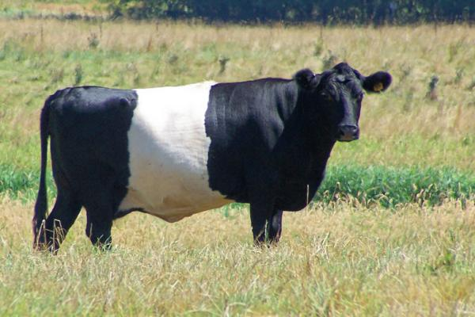

The Netherlands are situated in the delta of the river Rhine, and as thus have a high risk of flooding, for example when snow is melting in the Alps. In order to prevent flooding of the areas directly surrounding the large rivers, the Dutch government is working on a long term project called *Ruimte voor de Rivier*, which should provide these rivers with space to flood within safe limits. This space is created by lowering surface level of the floodplains, deepening the riverbeds, relocating the dikes and fortifying them, and creating side streams and retention areas which can flood at high water levels. In addition to these measures, the floodplains are also freed from as many obstacles as possible [@velzen2003stromingsweerstand].

The obstacles in these areas include anything that the water cannot flow through, or will slow it down significantly. This includes, but is not limited to houses, bridges, agricultural fields, and forested areas. A large number of such structures have already been removed from these areas, and most agricultural practice in the floodplains along the rivers in The Netherlands has been abandoned. The more natural vegetation that thus is allowed to grow in these areas will grow abundantly.This abovementioned natural vegetation will evolve from the initial grassland, into a more complex herb cover, later shrubbery will occur, and in the final succession stages trees will form a forest. As the vegetation proceeds into rougher stages, the hydraulic conductivity will increase as well and this might slow water down significantly [@overheid].

In many floodplains, grazers are used to keep these areas free from vegetation. They eat plants before the vegetation has the change to proceed into the afforementioned higher levels of succession. However, it is unclear whether these grazing schemes are successful in keeping the vegetation low and smooth.

Dutch cattle, @cattle

Monitoring the vegetation succession in the field before and after (long-term) grazing is time consuming and expensive. The lack of insight in the consequences of this management is an issue in the entire Netherlands, since this practice is widespread throughout the floodplains and other (semi-) natural areas. As it is unknown how effective this method is, this could potentially cause significant problems during (controlled) flooding of the floodplains when the water levels are high in the rivers. The resulting floods will affect a large number of people living close by, as well as those people that manage the areas, such as the nature conservation groups and the governmental organisations.

Currently, a limiting factor is the availability of both actual and historic maps of the vegetation structure in the floodplains which are managed in the above mentioned way. Either the required spatial detail, the right frequency in time, or the relevant vegetation typology is missing, often all of these are lacking. Spectral imagery could be a valuable data source to track vegetation succession over time. Images of different years are used as input for a vegetation classification. The results can be compared to detect the changes in vegetation. The project aims to present an easy and repdruclible procedure to create these maps.

***

 
 
 
 
