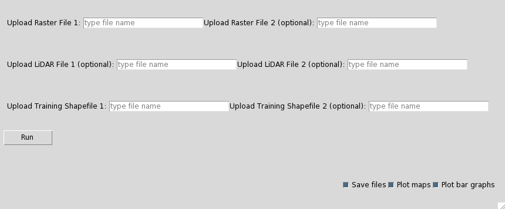

This is the explanation on how to use the application to create vegetation maps.
The first step is to start the program. A main window will pop up, as it can be seen below.

  

This main window consits out of fields to load your data into the program. To create a map, you need at least one areal image and one [training polygon dataset](T_preproc_poly.html). If you only want to create one map, all you have to do is to upload your imagery in the field *Upload Raster File 1* and your training dataset in the field *Upload Training Shapefile 1*. Then you can use the checkboxes in the lower right corner of the window if you want to save the output files, plot the maps, or open the bar graphs with statistical information. After uploading the required datasets, you only have to press the *Run* button, and the application will create the map.

However, it is also possible to compare vegetationimages from different years. In this case, the application will automatically analyse the differences between the two images and create maps of each year as well as vegetation change maps and a statistical analaysis of the vegetation change. If you have two different training polygon files for the two images, you have to upload the one that should be used for the second image in the field *Upload Training Shapefile 2*. This is optional as the classification of both images can also be done based on only one training dataset.

Another optional function is the inclusion of LiDAR data into the classification. If LiDAR data is available, you can upload it in the fields *Upload LiDAR File 1* for the first image and *Upload LiDAR File 2* for the second image, respectively. 

***
