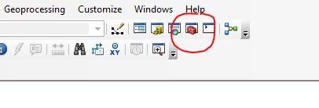
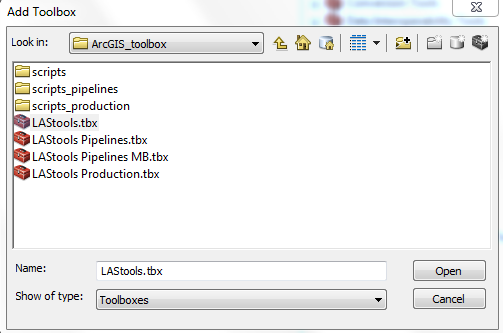
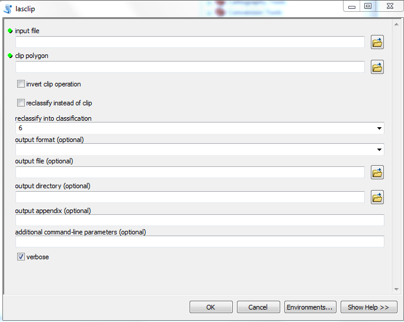

Before LiDAR data can be used by the application, it should be clipped to the extend of the study area to reduce the amount of data, since the computation time might be too much to handle for an ordinary computer otherwise. The clipping can be done using ArcGIS and the free toolbox [LAStools](https://rapidlasso.com/lastools/), which can be downloaded [here](http://www.cs.unc.edu/~isenburg/lastools/download/LAStools.zip).

After downloading the toolbox, unzip the file and save the tool on your hard drive. Then, open a new document in ArcMap and import your LiDAR data. After that, click on the toolbox icon as it is shown below.

  

After that, right-click on *ArcToolbox* and click on *Add Toolbox*. A new window will open, looking like this:

  

Click on the *Connect to folder* button in upper right corner and naviagte to the folder containing the toolbox. Select the file *LAStool.tbx* and press open. 

The toolbox is now added to ArcMap. To clip the LiDAR data to the correct extend, click on the *ArcToolbox* icon again. Choose the *LAStool* toolbox and select the tool *lasclip*. The tool window opens, as it can be seen below. 

  

Use the following input and output features:  
- **Input File: **LiDAR dataset  
- **Clip Polygon:** shapefile of borders of study area  
- **Reclassify into Classification:** leave this at 6  
- **Output Format:** leave this one blank  
- **Output File: **folder and name for new file  
- **Output Directory:** leave this one blank  
- **Output Appendix:** leave this one blank  
- **Additional Command-line Parameters:** leave this one blank  

Leave the rest of the setting on default and press *OK*. Your dataset will then be clipped and is ready to use in our application.

***
