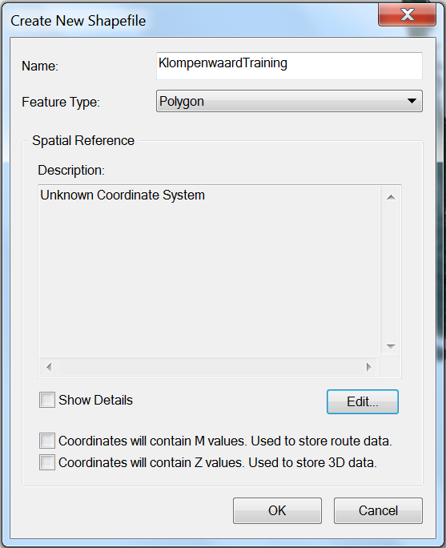
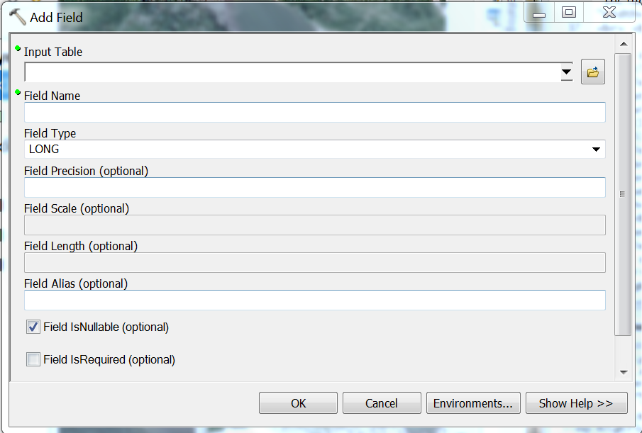
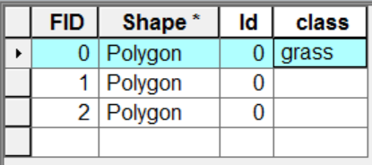

In order to classify your study area, you will need an areal image of your study area with a blue, green, red, and NIR band. If multiple years need to be compared, two of these images, one for each year, are needed. It is advised to extract the exact study area, since this improves the classification. Bellow it is described how to extract the exact area in ArcGIS using a shapefile (.shp) of the borders and the areal photograph in .tiff format.

For the supervised classification method, training data polygons are needed as well. How to make a shapefile containing these in ArcGIS is described in the second part below.

***
### Define Study Area Extent
Open ArcMap and connect to the folder with holds the shapefile with the borders of the study area ad the areal image of the study area. 

If it is not the default coordinate system, change it to *RD_New*. Otherwise the training areas might not match with the extent on which it is based on. To do this, right click on Layer, go to *Properties*, find the tab *Coordinate System* and search for *RD_New*. Make sure to use the European projection.

Add the shapefile with the borders of the study area and areal image to the .mxd file by dragging them from the folder in the *Catalog* to the *Table Of Contents*. Make sure that they have the same graphical extent by checking the source tab.

Find the *Clip* tool in the *Analysis Tools* subfolder *Extract* in the *ArcToolbox*. The following screen will open:

  

Use the following input and output features: 
- **Input Features:** areal photograph of study area  
- **Clip Feature:** shapefile of borders of study area 
- **Output Feature Class:** folder and name for new file 
- **XY Tolerance:** leave this one blank 

Press *OK*. The resulting output is the areal photograph of the study area, and no surrounding land. This should be done for each year, if you wish to compare multiple years.

***
### Create Training Data Polygons
To determine trainings polygons in the study area, add a new layer. To do this, click with your right mouse button on the folder in *Catalog* in which the layer should be produced. Click on *New*, and then choose *Layer*, see image below. 

 

A dialog box, such as the one below, will pop up in which the name of the new layer can be specified. Define the name and folder and change *Feature Type* to *Polygon*.

 

Then click the *Edit* button and specify the *Spatial Referenc**. Find for *RD_New* in the European projections, see image below for the screen in which this should be done.

 

By now you should have a layer with the areal photograph of the study area, and an empty layer on top of it. In this empty layer, you now will be adding the training polygons.

In order to start drawing the first training polygon, enable the *Editor Toolbar*. If this is not already available, enable it in *Customize* at the *Toolbars* menu. When the *Editor Toolbar* is available, select the empty layer, and under the dropdown menu at *Editor* click *Start Editing*. Now select the empty layer in which you will add the training data in the *Create Features* windown to the right, and at the bottom under *Construction Tools* select *Polygon*.

You can now start drawing the first training polygon. To do this click each of the corners of a spot you wish to use as a training area, double clicking the last. Small deterministic polygons are important for good classification. Draw these trainings areas in all vegetation types which you want to be classified. By default, these determined classes are called as followed and represent in the following image with the numbers in brackets: **grass**, **shrub**, **trees**, **soil**, and **water**. It is possible to define up to eight classes, but the amount of classes does not necessarily improve the classification, the accuracy of your training polygons is much more important. Make sure to include all differences in colours within one class. We recommend having at least 10 training polygons for each vegetation type, and at least 5 for other classes. For an example, see the image below.

 

When enough trainings areas are drawn, they need to be renamed. First stop editing by clicking *stop Editing* in the dropdown menu under *Editor*. Then open the *ArcToolbox*. Find the *Data Management Tools*, and open the folder *Fields*, there click the *Add Field* tool. This opens the following diaolog window.

 

Here you can add a new field to the table containing the training polygons, which will be used to determine their class. Use the following input and output features: 
- **Input Table:** the layer with the training polygons 
- **Field Name:** type *class* here 
- **Field Type:** choose *text* 
- **Field Precision:** leave this one blank 
- **Field Scale:** leave this one blank 
- **Field Length:** leave this one blank 
- **Field Alias:** leave this one blank 

Leave the tickboxes as they are and press *OK*.

Now open the attribute table of the trainings areas, by right clicking the layer which contains the training polygons in the *Table Of Contents* and selecting *Open Attribute Table*. Enable editing again  under the dropdown menu at *Editor* click *Start Editing*. In the attribute table, double click the *class* field. Rename the polygons so that the names now indicate to which class each polygon is supposed to belong, see image below where the first polygon has been renamed.

 

When you are finished renaming all the polygons, stop editing by clicking *stop Editing* in the dropdown menu under *Editor* and save the edits with the *Save Edits* button in the same dropdown menu. The shapefile created in this way can be used for supervized classification in the R script.

***