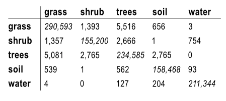
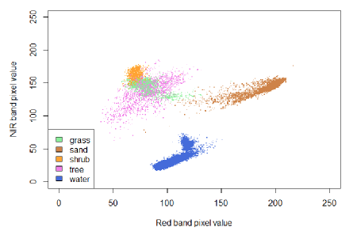

On this page, you can see a possible output of the application. Three interactive maps are created of the classified vegetation, and the change between the years. On the upper right part, the different basemaps and the classification results can be selected.

For more information on interactive maps, see [the tutorial on interactive mapping](T_Leaflet.html).

```{r setup, include=FALSE}
knitr::opts_chunk$set(echo = TRUE)
library(rgdal)
library(leaflet)
library(htmlwidgets)
library(raster)
library(tiff)
library(knitr)
```
***
### Classified Vegetation Map
The following interactive map is the result of running the vegetation classification part of the script. If only one areal photo is used, only one vegetation classification will be returned in this interface. This particular example shows  the classification result for a calculation with and one without additonal LiDAR data. When you compare the two maps, it is easy to see that especially trees and shrubs are often confused when only spectral imagery is used. 

The vegetation stability shows in which areas the chages takes place (red) and where both calculation have the same result (green). This map is added to the interface to assist the comparing of the two vegetation classification results. 

```{r map one, echo=FALSE, include=TRUE, message=FALSE, warning=FALSE}

load("Tutorial_files/leaflets.RData")


raster_classes1 <- raster("Tutorial_files/raster1_class.tif")
raster_classes2 <- raster("Tutorial_files/raster2_class.tif")
change_raster <- raster("Tutorial_files/changes_binary.tif")
changes_class  <- raster("Tutorial_files/changes.tif")
class_names <-class_names_1
classes_colours <- classes_colours
nclasses <- nclasses
  
  # raster_classes1<-projectRaster(raster_classes1,crs=CRS("+init=epsg:3857"),method="ngb")
  # raster_classes2<-projectRaster(raster_classes2,crs=CRS("+init=epsg:3857"),method="ngb")
  
  pal = colorFactor(classes_colours[1:nclasses], 
                    domain=(1:nclasses), na.color = "transparent")
  # Define colors to use for vegetation stability
  pal2 = colorFactor(c("lightgreen", "orangered"),
                     domain = (c("1", "2")),
                     na.color = "transparent")
  
  # Build Map
mymap = leaflet(width=910, height=500)%>%
    
    addProviderTiles("OpenStreetMap.BlackAndWhite", group = "Openstreetmap") %>%
    addProviderTiles("Stamen.TonerLite", group = "Stamen Toner Lite")%>%
    addProviderTiles("Stamen.Watercolor", group = "Stamen Watercolor")%>%
    
    # Add vegetation map 1 to map
    addRasterImage(raster_classes1, 
                   group="Class with LiDAR", 
                   colors=pal, 
                   project=FALSE)%>%
    # Add vegetation map2  to map
    addRasterImage(raster_classes2, 
                   group="Class without LiDAR", 
                   colors=pal, 
                   project=FALSE)%>%
    # Add stable/unstable to map
    addRasterImage(change_raster,
                   group ="Vegetation Stability",
                   colors = pal2,
                   project = FALSE)%>%
    
    
    # Add switch between layers
    addLayersControl(baseGroups = c("Openstreetmap", "Stamen Toner Lite", "Stamen Watercolor"),
                     overlayGroups = c("Class with LiDAR",
                                       "Class without LiDAR",
                                        "Vegetation Stability"),
                     options = layersControlOptions(collapsed = FALSE)) %>%
    
    
    # Add legend
    addLegend("bottomleft", 
              colors=classes_colours[1:nclasses],
              labels = class_names, 
              title="Vegetation Classes",
              opacity=1)%>%
    # Add stability legend
    addLegend("bottomright",
              colors=c("lightgreen", "orangered"),
              labels = c("stable", "unstable"),
              values = veg_stable, title="Vegetation Stability",
              opacity=1)

mymap

```

For more information on how these maps are created, see [the training dataset tutorial](T_preproc_poly.html), [the LiDAR preprocessing tutorial](T_preproc_LiDAR.html), and the [the classifying vegetation tutorial](T_veg_class.html).

***
### Overall Vegetation Change Between two years
From the previous results, the script calculates the change between the two years by comparing each pixel. The output is the interactive map as shown below. A lot of classes are shown, since each possible combination between two classes should be potentially available. 

```{r map two, echo=FALSE, include=TRUE, message=FALSE, warning=FALSE}


source("functions/visualize_differences_leaflet.R")

 diffmap <- visualize_differences_leaflet(change_raster, changes_class, colour_labels)

 diffmap

# Insert leaflet of map with vegetation change


```

For more information, see [the tutorial on vegetation succession](T_veg_change.html).

***
### Vegetation Change Between two years per Class
If the user is interested in the change of a particular vegetation class, the following map is useful. It shows the change in each class, one at the time as the user chooses the class they are interested in at the top right of the interactive interface. It shows which parts of that class are stable, and which change. The latter shows both the change from another class into this class, as the change from this class into another class. 

```{r map three, echo=FALSE, include=TRUE, message=FALSE, warning=FALSE}

source("functions/visualize_results_sep_leaflet.R")

classchange <- visualize_results_sep_leaflet(changes_class, colour_labels, classes_poly1, nclasses)

classchange

```

For more information, see [the tutorial on seperate vegetation change maps](T_change_sep.html).

***
### Statistics and Vallidation
In order to be able to get a clear insight in the surface area of the vegetation classes that have changed, the numbers of each class for both years will also be returned by the script. The following matrix is roughly what this will look like. The x-axis shows the class the number of pixels belonged to in year one, and the y-axis shows year two.

<center></center><br>

If the user would like to see how well the classification was made, then the following image is also made. This scatter plot shows the spectral values of the training data in the NIR and the red band. If all the values of a single class are grouped close together, but far from the other classes, that means that they are easy to identify based on these two bands and will thus be best classified. See the water class in the image below. Since the different vegetation classes all have similar characteristics, it is to be expected that they overlap more. Therefore, the error will be slightly larger. However, in the example below, the groups do cluster quite well.

<center></center><br>

For more information, see [the tutorial on statistics](T_change_stat.html).
